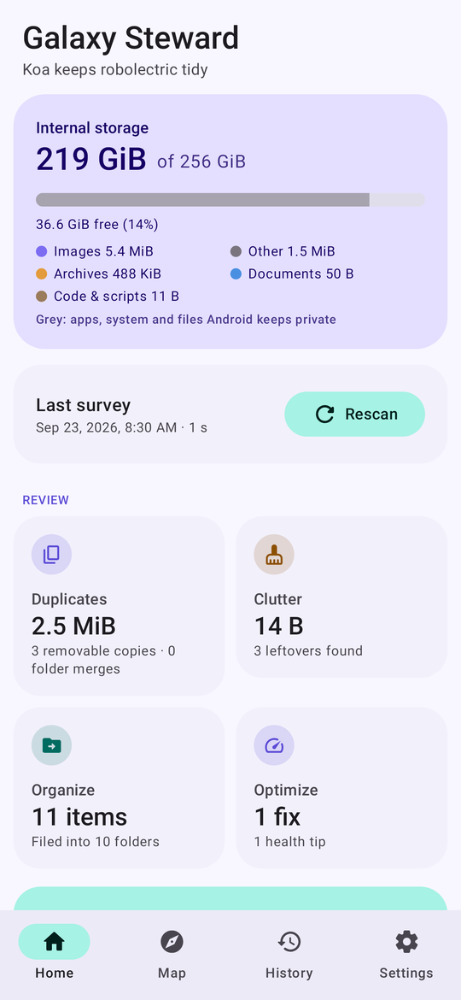
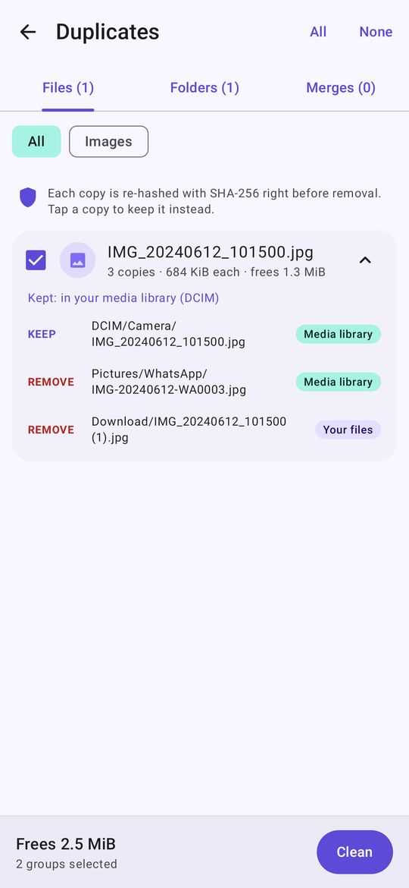
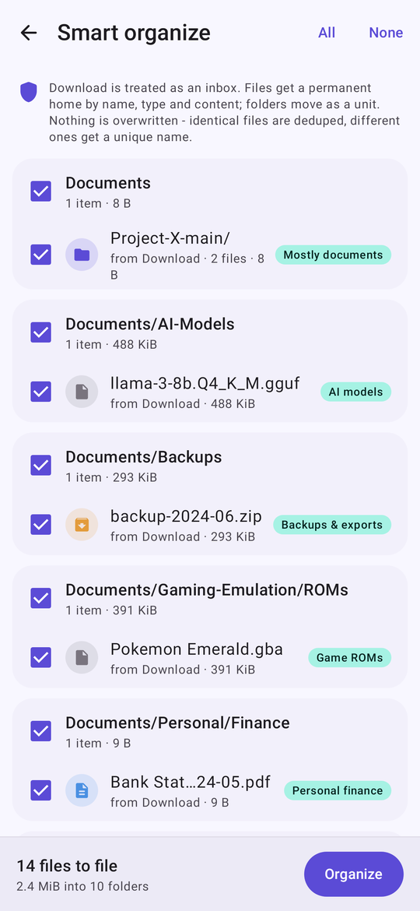
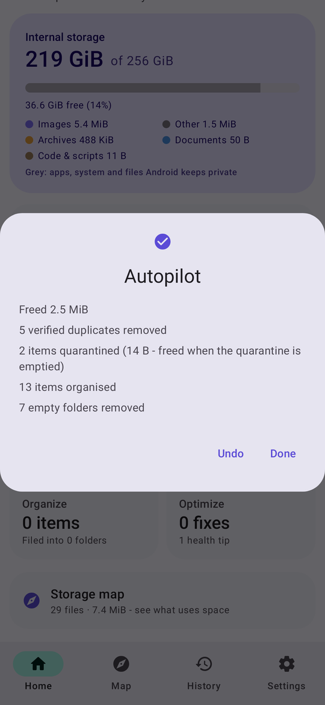
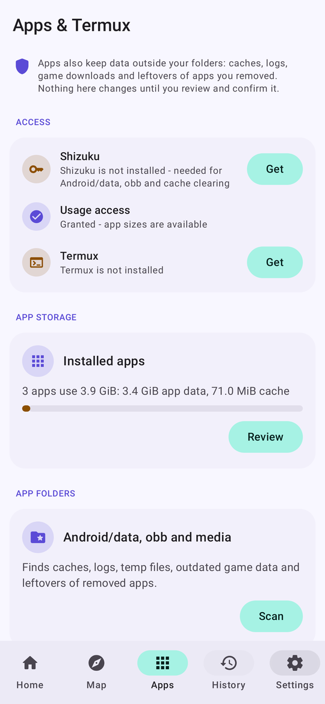
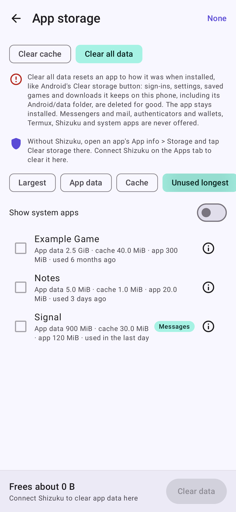
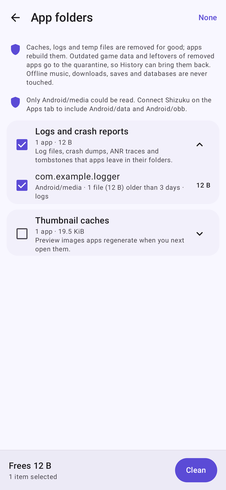
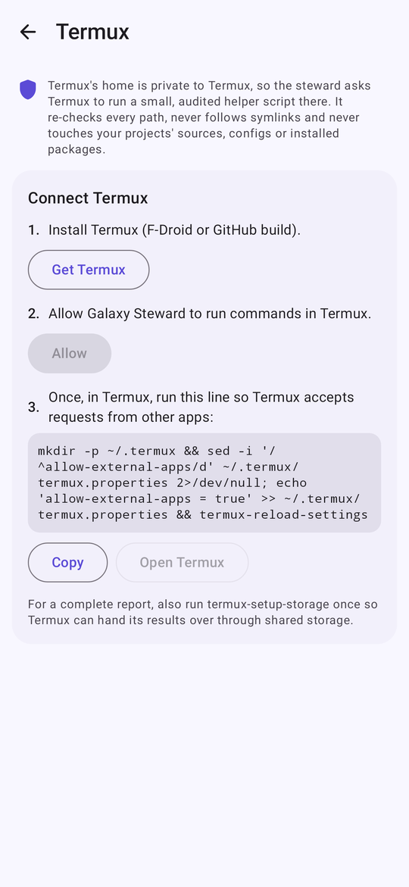

# Galaxy Filesystem Steward

An Android app that cleans, deduplicates, organizes and optimizes your phone's shared storage. It's a native
port of the **Koa Whole-Device Storage Steward v18.2** Termux script, with the same safety rules: scans never
change anything, you approve every change, each file is re-checked right before it's touched, and every run can be
undone.

Built with Kotlin and Jetpack Compose (Material 3 / Material You). Minimum Android 8.0, targets Android 16, and
tuned for Galaxy devices such as the S23 series.

<p>
  
  
  
  
</p>

<p>
  
  
  
  
</p>

<sub>Screenshots are rendered by the end-to-end test from a sample storage layout.</sub>

## What it does

| Area | What it finds | What happens when you approve it |
|---|---|---|
| **Duplicate files** | Exact duplicates anywhere in shared storage. Files are grouped by size, then compared by a quick head+tail fingerprint, then by full SHA-256, with parallel workers and a persistent hash cache. | Keeps the best copy (camera roll before Pictures, organised Documents before Download, an original name before "(1)"/"copy", the oldest before newer). Both copies are re-hashed right before the extra one is deleted, or quarantined if you prefer. |
| **Duplicate folders** | Whole folder trees that are identical (names, sizes and content). Only the top-most matching pair is reported. | Removes the redundant tree file by file, checking each file against the kept tree. |
| **Folder merges** | Folders that share most of their content, e.g. `Download/Trip` and `Pictures/Trip`. | Moves the files that are unique into the kept folder and removes the verified duplicates. |
| **Clutter** | Abandoned partial downloads, old `/log` dumps, empty folder trees, gallery trash, `.thumbnails` caches, zero-byte files, APKs for apps already installed, and folders left behind by apps you've uninstalled. | Quarantined, so you can restore them until the quarantine is emptied (manually or after a retention period). Empty folders are removed. |
| **Smart organize** | Treats `Download` as an inbox. Every file and folder gets a permanent home based on its name, type and content: finance, travel, health, device firmware, diagnostics, APKs, archives, e-books, AI models, ROMs, backups, and more. | Moves files with no overwriting: identical files at the destination are deduplicated, and different files with the same name get a hash suffix. Folders move as a unit. Wrapper folders like `Documents/Documents` are dissolved. |
| **Optimize** | Nested duplicate-name folders (`X/X/...` left by extracted archives), very large flat folders, very deep paths, and low free space. | Collapses the redundant levels and sorts huge photo and video folders into year (or month) buckets. The rest is reported as advice. |
| **Storage map** | Folder-by-folder breakdown with size bars, largest files, a breakdown by file type, and the ownership zone of each folder. | Read only. |
| **History** | Every run, with what it freed, moved, deduplicated or quarantined. | **Undo** replays the journal backwards and checks each step before reverting it. Quarantine can be emptied per run or all at once. |
| **Weekly audit** | Optional read-only scan while the phone charges. The first one runs a day after you switch it on. It skips a week when you scanned within the last day, and stops as soon as you start a scan or clean-up yourself. | Sends a notification saying how much space you could reclaim. It never changes files, except emptying quarantines that are past their retention period. |
| **App storage** | What every installed app stores, split into app size, app data (accounts, messages, offline downloads) and cache, with when each app was last used. Sort by size or by **Unused longest**. Apps appear as soon as each one is measured. Needs usage access. | **Clear cache** clears only the cache of the apps you tick, through Shizuku. **Clear all data** resets the apps you pick, exactly like Android's App info → Storage → Clear storage (`pm clear` through Shizuku). Nothing is preselected, and it asks you to confirm that it can't be undone. Messengers and mail, authenticators, password managers and wallets, Termux, Shizuku and system apps are never offered. Both kinds of clear count only when the app's live size actually drops. The ⓘ button opens Android's App info. |
| **App folders** | `Android/data`, `Android/obb` and `Android/media`: cache folders, logs and crash dumps, temp files, thumbnail caches, outdated OBB game data, and folders left by apps you removed. Also lists the largest files each app keeps. | Caches, logs and temp files are deleted for good (apps rebuild them). Outdated OBBs and leftovers are quarantined, so they can be undone. |
| **Browse app folders** | `Android/data`, `Android/obb` and `Android/media` folder by folder, like a file manager: every app's folder, then each file and subfolder with its total size, largest first. | Tick any files or folders and remove them. By default they go to the quarantine (History can undo it); one switch deletes them for good instead. An app's own top folder, protected apps, links and key-like files are never removed, and files changed after you opened the folder are kept. |
| **Termux** | Termux's private home and packages: APT downloads, pip/uv/Poetry/npm/Go/Cargo/rustup/Bun/Android SDK caches, caches inside proot distributions that aren't running, build outputs Git ignores in your projects, and everything else in `~/.cache`. | Termux runs a small audited script ([`termux-steward.sh`](core/src/main/resources/com/galaxy/steward/core/termux/termux-steward.sh)) that checks every path again before removing it. Installed packages, configs and sources are never touched. |
| **Logcat export** | The device log, for reporting a problem. With Shizuku connected it's the whole device log (the main, system, crash and events buffers); without it, Galaxy Steward's own lines. | **Settings → Diagnostics → Export** saves it to `Documents/Galaxy Steward LogCat/logcat-<date>.txt`, and **Share** sends it to another app. The steward never moves, deduplicates or cleans that folder. Every scan, clean-up, undo, Termux audit and export also writes one summary line (counts, sizes and durations, never file names) under the `GalaxySteward` tag. |

**Autopilot** on the home screen applies everything that's currently selected in one confirmed run. It works in the
safest order: dedupe, then clutter, then layout fixes, then filing.

### Where things get filed

```
Documents/
  Reference/  Spreadsheets/  Presentations/  Data/  Books/  Fonts/  Design/  3D-Models/
  Reports/  Reports/Diagnostics/  Research/
  Personal/Finance/  Personal/Travel/  Personal/Health/  Personal/Career/  Personal/Contacts-Calendar/
  Software/APKs/  Software/Installers/  Archives/  Backups/
  Development/Scripts/  Development/Build-Artifacts/  Development/Android/
  Android-Device/<your-device>/Firmware/      <- device label is detected, e.g. Samsung-SM-S918B
  Security-Reversing/  AI-Models/  Audio-DSP/  Gaming-Emulation/  Gaming-Emulation/ROMs/
  Inbox-Review/                               <- unrecognised files; not selected by default
Pictures/Imported/<year>/   Pictures/Screenshots/   Movies/Imported/<year>/   Music/Imported/   Recordings/Imported/
```

You can add your own keyword and file-type rules in **Settings → Custom filing rules**. They run before the
built-in ones, for example `acme, invoice*` + `pdf` → `Documents/Work/ACME`.

### App data, Shizuku and Termux

Since Android 11, no normal app can read `Android/data` or `Android/obb`, or clear another app's cache. The **Apps**
tab uses two optional helpers that are already on your phone:

- **Shizuku** gives the steward a small helper process with ADB-level rights (no root). The helper only exposes fixed
  operations: the same app-folder scanner and cleaner as the rest of the app, with all their checks, a cache-only
  clear for one package (`cmd package clear --cache-only`), a full data clear for one package you picked
  (`pm clear`, after checking it again against the same rules and that it isn't a system package), a read-only folder
  listing for the app folder browser, granting the app usage access, and one fixed `logcat -d` for the logcat export
  (only the shell user may read the whole device log). It has no general command runner. Start Shizuku, tap **Allow**, and the Apps tab does the rest. Without Shizuku the app can still
  scan `Android/media` and show app sizes.
- **Termux** keeps its home private to itself, so the steward asks Termux to run the helper script through Termux's
  own `RUN_COMMAND` bridge. Tap **Allow** on the Apps tab, then paste this once into Termux:

  ```
  mkdir -p ~/.termux && sed -i '/^allow-external-apps/d' ~/.termux/termux.properties 2>/dev/null; echo 'allow-external-apps = true' >> ~/.termux/termux.properties && termux-reload-settings
  ```

  Run `termux-setup-storage` too, if you haven't already. The script then hands its full report back through shared
  storage, so a large report isn't cut off.

App-data rules carried over from the Termux steward's strict v18 policy:

- **Amazon Music and Audible are never touched**: nothing is cleaned, stopped or cleared.
- **Scans and clean-ups only delete regenerable data**: cache folders, logs, crash dumps and temp files older than a
  set age. They never delete offline media, downloads, saves, databases (LevelDB/RocksDB write-ahead logs are
  recognised), or anything with a credential-like name.
- **All of an app's data is only cleared when you pick that app** under App storage → Clear all data and confirm it.
  That is Android's own Clear storage: it empties the app's private data and its `Android/data` folder, signs you out
  and can't be undone. Apps whose data may be the only copy of something (messengers and mail, 2FA authenticators,
  password managers, crypto wallets) are never offered, but no list can name every such app, so check before you
  confirm.
- **Cache clears are checked against live storage statistics.** You can have each app stopped first, which clears a
  little more. It's off by default, because a stopped app gets no notifications until you open it again. System apps,
  Google Play services, Samsung apps, messengers, mail and social apps, Termux and Shizuku are never stopped.
- A folder only counts as a **leftover** when Android doesn't know its package at all. Apps removed with "keep data"
  and archived apps count as installed. If the package list looks unreliable, nothing is reported as a leftover.

## Safety model

These rules come from the Termux steward and are enforced both when the plan is built and again right before each
operation runs:

- **Scans are read-only.** Nothing changes until you confirm a dialog, which replaces the script's confirmation
  tokens (`CLEAN_SAFE`, `SMART_ORGANIZE`, and so on).
- **Ownership zones.** `Android/` (data, obb, media) is strictly off-limits, and app-owned copies are never used
  as the "kept" copy of a duplicate. Projects (`.git`, Gradle, Cargo, `pyproject`, `package.json`+`src`, and so on) and
  folders you pin in Settings are never moved or removed, though they can serve as the kept copy. Media-library copies
  are only removed when the kept copy is also in the media library.
- **Credential-like files are never touched**: keystores, `.pem`/`.key`/`.p12`, `.env`, SSH keys, `.kdbx`,
  `.ovpn`, recovery codes, wallets, and anything with "secret" or "credential" in the name.
- **Checks right before each change.** Paths must be canonical and free of symlinked parts. File size and
  modification time must match the scan. Before any deletion, both copies are re-hashed with a fresh SHA-256.
  Moves never overwrite anything. Files changed within the last 10 minutes are left alone.
- **Journaled and undoable.** Each verified change is written to a TSV journal before the next one starts, so a run
  that's interrupted or cancelled still has an accurate record. Undo recreates deleted duplicates from the kept copy,
  moves files back, and restores quarantined items.
- **Quarantine** lives at `/storage/emulated/0/.StorageSteward/Quarantine/<run>/` on the same volume, so
  quarantining is an instant rename. A `.nomedia` marker keeps galleries from indexing it.
- **Runs survive switching apps.** A foreground service keeps a scan, clean-up or undo running if you leave the
  app. Afterwards, the affected folders are rescanned for the media index (not every file one by one), so galleries
  pick up the new layout without keeping Android's media service busy for minutes.
- **Source trees keep their shape.** Folders inside `src`, `smali*`, `java`, `node_modules` and similar trees, or
  containing code, are never flattened: `com/acme/model/model` is a package path, not a redundant wrapper.
  Decompiled apps are treated like projects: apktool output (`apktool.yml`, `smali*`), jadx output (`sources` next to
  `resources`) and unpacked APKs (`classes.dex` next to `AndroidManifest.xml`). So are two kinds of folder below the
  top level: development folders (`Download/Projects`, `Documents/src`, `jadx`, `decompiled`, and so on), and folders
  with at least 50 code files that make up at least half of their files. None of these are moved, date-sorted or
  deduplicated, though they can serve as the kept copy.
- **Only photo and video dumps are sorted into date folders.** Preset libraries, datasets, music and documents are
  found by name, so a huge flat folder of those is reported but never split up by date.

## Install

1. Download
   [`galaxy-steward.apk`](https://github.com/Zfkirke0109/Galaxy-Filesystem-Steward/releases/latest/download/galaxy-steward.apk)
   from the latest release and install it. You'll need to allow installs from your browser or file manager. To get
   updates automatically, add this repository to [Obtainium](https://github.com/ImranR98/Obtainium) or GitHub Store
   instead.
2. Open the app and grant **All files access**. The app has no internet permission, so nothing leaves your phone.
3. Optional: on the **Apps** tab, connect Shizuku (for `Android/data`, `obb` and cache clearing), grant usage access
   (for app sizes), and connect Termux.

Every build is signed with the same release key, so each new version installs over the last one and the app keeps
its settings and history. Builds made before release signing was set up each had a different throwaway key: uninstall
such a build once before installing a release, and undo any runs you still want undone first. The
[signing guide](docs/SIGNING.md) covers the one-time key setup and how CI signs, checks and publishes each build.
Every workflow run also keeps its APK as an artifact, including runs for pull requests.

## Build from source

Requirements: JDK 17 or later and the Android SDK (platform 36).

```bash
./gradlew :core:test              # engine unit tests (plain JVM, fast)
./gradlew :app:testDebugUnitTest  # end-to-end app test (Robolectric) + screenshots in app/build/outputs/roborazzi
./gradlew :app:assembleDebug      # app/build/outputs/apk/debug/app-debug.apk
./gradlew :app:assembleRelease    # shrunk with R8; signed with the release key if one is configured
```

Release builds keep real class names and line numbers, so crash traces in a phone's logcat are readable without a
mapping file. To sign local builds with the release key, see [docs/SIGNING.md](docs/SIGNING.md#building-locally-with-the-key).

The engine tests run against real temporary directories. They cover keeper choice, the protected zones, fresh
SHA-256 re-checks that catch content changed after a scan, quarantine, folder deduplication and merges, filing
rules, clutter detection, layout fixes, and undo. They also cover app folders: the scan-clean-undo round trip
through the same line protocol the Shizuku helper uses, plus refusals for protected apps, changed files and
reinstalled apps. The Termux script tests run the real `termux-steward.sh` with bash against a throwaway fake Termux
home. They check symlinked caches, forged paths, tracked sources, unknown targets and truncated output. The app test
scans a sample phone layout through the real ViewModel, opens every screen, applies Autopilot, checks the result
file by file on disk, then undoes the run and checks that everything was restored. It also cleans a sample
`Android/media` folder from the Apps tab, and exports a logcat from Settings, then shares it and reads it back through
the app's file provider.

## Architecture

```
core/   Pure Kotlin/JVM engine, no Android dependencies, unit-tested against real temp directories
  scan/       TreeScanner: walks storage without following symlinks; assigns ownership zones and safety flags
  hash/       Quick fingerprints, SHA-256, persistent hash cache
  dedupe/     DuplicateFinder, FolderAnalyzer (exact trees and partial overlaps), keeper ranking
  junk/       JunkPlanner
  organize/   Keyword and extension rules, OrganizePlanner (the semantic layout planner)
  optimize/   OptimizePlanner (flattening, date buckets, health insights)
  exec/       ActionExecutor, PathGuard, JournalStore, RollbackEngine, QuarantineManager, MediaRescan
  appdata/    AppDataScanner and AppDataExecutor for Android/data|obb|media, and the helper line protocol
  termux/     termux-steward.sh (resource), target catalogue and output parser
app/    Android app: Compose UI, ViewModel, settings, WorkManager weekly audit, MediaStore rescans
  shizuku/    Shizuku bridge and StewardHelperService (runs as the shell user inside Shizuku)
  termux/     RUN_COMMAND bridge and result receiver
  apps/       Per-app storage stats, last use, cache clears and full data clears
```

### From the Termux script to the app

| Termux mode | In the app |
|---|---|
| `audit`, `catalog` | Smart scan, storage map, health insights |
| `duplicates`, `steward-dedupe` | Duplicates → Files / Folders / Merges |
| `organize-plan`, `organize-smart SMART_ORGANIZE` | Smart organize |
| `rollback-organize` | History → Undo (covers every kind of run) |
| `safe`, `quarantine-logs`, `all-safe` | Clutter (stale downloads, old logs, empty folders, …) |
| `autopilot BALANCED_AUTOPILOT` | Autopilot card on the home screen |
| hash-hint cache and benchmark-guided workers | Persistent hash cache and CPU-scaled parallel hashing |
| `safe`, `dev-cache`, deep Termux and proot cleanup, repo build outputs | Apps → Termux |
| `app-cache-audit`, targeted cache adapters (rish) | Apps → App storage (through Shizuku) |
| `rish` `Android/data` sizing | Apps → App folders (through Shizuku) |

### What's deliberately left out

- **Device-wide `pm trim-caches`.** The v18 script disabled it because it can't exclude Amazon Music or Audible.
  Caches are cleared app by app instead.
- **Deleting single files inside `/data/data`.** Only root can reach inside another app's private data. Without root
  the only option is all or nothing, Android's Clear storage, which App storage → Clear all data offers for the apps
  you pick.
- **Pruning Git history** (`git gc`, repacking). Build outputs that Git ignores can be cleaned; repository history is
  left alone.

On "faster I/O": the app speeds up everyday file access by freeing space (flash storage slows down and wears
faster when nearly full), by removing duplicate and junk files that galleries and file managers would otherwise index,
and by splitting very large flat folders. It doesn't change filesystem settings or run TRIM, which Android
already schedules itself.
